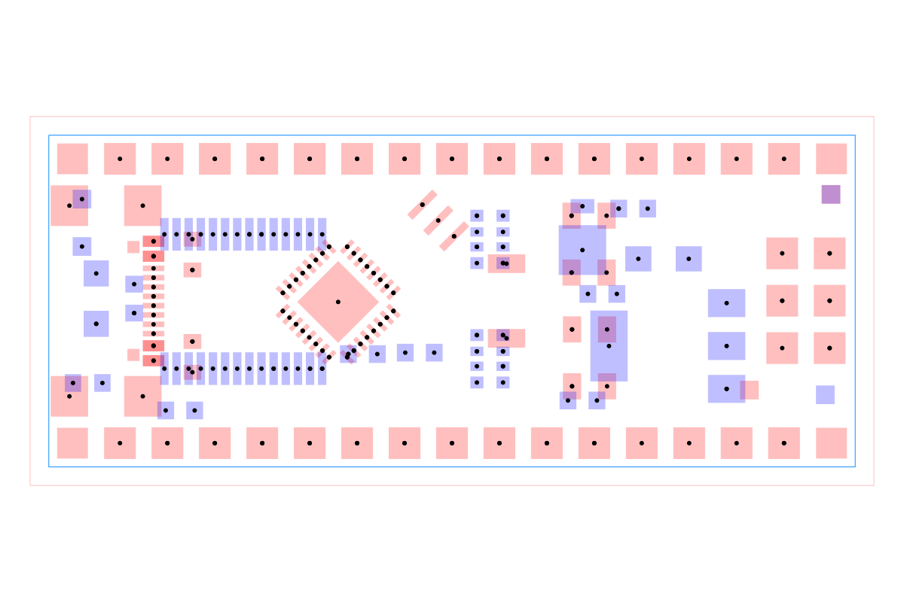

# dataset-srj18

Simple Route JSON dataset generated from five KiCad Arduino boards and eleven
Antmicro boards.

Arduino boards:

- Arduino Leonardo
- Arduino Mega 2560
- Arduino Micro
- Arduino Nano
- Arduino Uno

Arduino source KiCad PCB files are downloaded from
<https://github.com/sabogalc/KiCad-Arduino-Boards/tree/main/KiCad%20Projects>.

Antmicro boards:

- DDR5_TESTBED
- DUAL_GMSL_SERIALIZER_ADAPTER
- FTDI_TOOLKIT
- GMSL_SERIALIZER
- HDMI_EDID_DEBUG_BOARD
- JOB_OCULINK_EXPANSION
- OCULINK_PCIE_ADAPTER
- OV5640_DUAL_CAMERA_BOARD
- OV9281_CAMERA_BOARD
- SDI_FIBER_ADAPTER
- USB_C_POWER_ADAPTER

Antmicro source repositories are listed in `source-files.json`.

## Example

The image below shows the Arduino Nano routing problem from `sample004`. It is
generated by constructing an `AutoroutingPipelineSolver`, calling
`.visualize()`, and converting the graphics object to SVG with
`graphics-debug`.



Regenerate it with `bun run generate:readme-image`.

## Dataset browser

Run `bun run cosmos` to inspect the representative sample. `bun run build:site`
exports the static catalog to `cosmos-export/` for Vercel.

## Usage

```js
const { sample001, dataset } = require("dataset-srj18")
```

## Regenerate

```sh
bun install
bun run generate
bun run test
```

The generator downloads `.kicad_pcb` files into `kicad_pcb/`, converts them to
Circuit JSON with `kicad-to-circuit-json`, and converts that output to Simple
Route JSON with `getSimpleRouteJsonFromCircuitJson` from `@tscircuit/core`.
